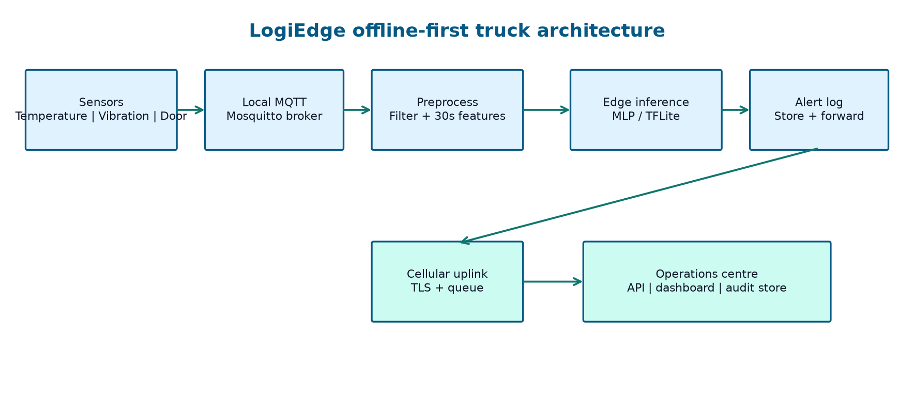
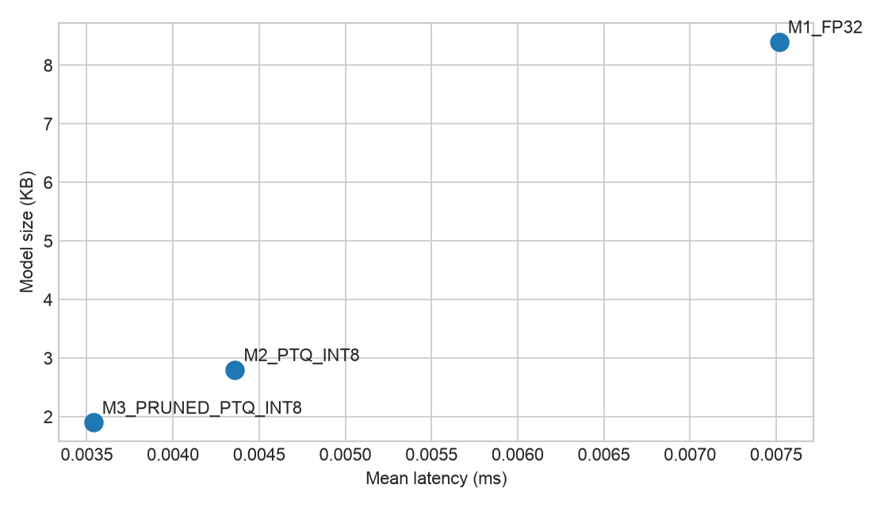

# LogiEdge: Cold-Chain Edge AI Platform

**AIML ZG535 | Machine Learning on Edge | Final Report**  
**Organisation:** FreightBridge Logistics Pvt. Ltd.  
**Deployment scope:** 85 refrigerated trucks, with a path to 265 vehicles

## Abstract

FreightBridge currently depends on manual temperature logs and cloud tracking despite operating routes with long cellular gaps. LogiEdge is an offline-first edge pipeline that samples temperature, compressor vibration, and door activity; filters and fuses the sensor streams into six features; classifies each 30-second window; and stores alerts locally until a cellular link is available. This report documents the architecture, hardware selection, data pipeline, model lifecycle, MLOps monitoring, optimisation evidence, and deployment recommendation. The reproducible implementation generates 294 labelled windows and reaches 100% held-out validation accuracy with the required two-hidden-layer MLP. Three deployment variants are benchmarked, and the structured-pruned INT8 variant is recommended subject to a Class 2 recall gate in field validation.

## 1. FreightBridge Deployment Context

### Edge constraints

Latency is the safety constraint. A failed refrigeration unit can increase cargo temperature by 1°C each minute, and the system must detect and alert within 90 seconds of a sensor signature. A cloud-only design adds uplink scheduling, rural radio variability, backhaul, cloud inference, and downlink acknowledgement. Although a healthy connection may have sub-second round-trip latency, the specified route has seven locations with 35–90 minute outages. More importantly, a cloud round trip is not a bounded latency guarantee. LogiEdge makes the safety decision on the truck. The local MQTT broker, five-sample filters, feature extraction, and MLP run continuously, while cellular communication is an asynchronous synchronisation path.

Bandwidth makes raw streaming uneconomic. With four bytes per scalar, temperature at 1 Hz creates 345,600 B/day. Three-axis vibration at 500 Hz creates 518,400,000 B/day. The combined raw volume is approximately 518.75 MB per truck per day, excluding timestamps and protocol overhead. At ₹0.10/MB this is ₹51.88 per truck per day, or approximately ₹4,409.80/day across 85 trucks. The edge output is much smaller: ten 512-byte alert records per day is 0.00512 MB and ₹0.000512 per truck per day. Raw data can remain local for forensic retention while only alerts, periodic health summaries, and synchronisation metadata traverse the modem.

Connectivity is treated as a normal operating state rather than an exception. A cloud-only system loses current visibility during a gap, cannot reliably acknowledge a critical event, and may create an incomplete chain-of-custody record. The LogiEdge node continues to sample and infer without cellular access. Alerts are timestamped, sequence-numbered, appended to a local durable log, and marked for store-and-forward delivery. When coverage returns, the uplink sends records in order and receives acknowledgements; duplicate delivery is made harmless with the event identifier.

Privacy is improved because raw cargo telemetry does not leave the vehicle by default. The operations backend receives the classification, confidence, sensor summary, device identity, and event time. The design supports encrypted local storage, device keys, TLS uplink, role-based backend access, and a retention policy. These controls give pharmaceutical clients a concrete contractual boundary: the continuous temperature and vibration stream is processed on the device, while the minimum evidence required for escalation and audit is synchronised.

### Hardware decision and Roofline analysis

The Constraint Triangle is latency/reliability, power, and cost. The Raspberry Pi 5 plus AI HAT+ is the best balance at approximately ₹15,000 and 7.5 W. It is below the 10 W AI budget, supports Linux containers and local MQTT, and provides 13 TOPS of accelerator capacity for a model whose 90-second deadline is generous after the local window closes. The Jetson Orin Nano Super is technically capable at 67 TOPS but costs approximately ₹45,000 and draws 15 W at moderate load, exceeding the stated budget. It would cost ₹3.825M for the 85-truck pilot. The STM32H7 option is attractive at ₹3,500 and 0.4 W, but its memory and software environment make the containerised pipeline, future model changes, and observability risky for a pharmaceutical pilot. Pi hardware costs ₹1.275M for the pilot and ₹3.975M at 265 vehicles.

Arithmetic intensity is $45\text{ MFLOPs}/18\text{ MB}=2.5$ FLOPs/byte. The Pi CPU ridge point is $16\text{ GFLOP/s}/12\text{ GB/s}=1.33$ FLOPs/byte. The model is therefore compute-bound under the supplied roofline numbers. The ideal compute lower bound is about 2.81 ms and the bandwidth lower bound is 1.50 ms. Full INT8 execution and structured pruning reduce arithmetic work, improve cache behaviour, and make accelerator execution practical. The 90-second system budget is not a license to ignore tail latency: the implementation keeps inference local and measures p95 rather than relying only on the mean.

**Figure 1.** Sensor-to-backend architecture. The local broker and alert log remain operational when the cellular uplink is unavailable.

## 2. Sensor Pipeline and MQTT Design

The simulator implements temperature at 1 Hz, vibration RMS at 0.5 Hz as the assignment's reduced representation of the 500 Hz three-axis source, and discrete door events. Normal temperature is sampled from $N(4.0,0.3)$ °C and normal vibration from $N(0.45,0.05)$ g. The temperature-drift mode adds 0.08°C per reading; the vibration mode switches to $N(1.2,0.15)$ g; combined mode activates both and creates OPEN/CLOSE events. The CLI accepts `none`, `temp_drift`, `vibration`, and `combined`.

The MQTT topic tree is `logibridge/trucks/{truck_id}/sensors/temperature`, `.../vibration_rms`, `.../door_event`, `.../inference`, `.../alerts`, and `.../sync/status`. Sensor and inference messages use QoS 1: duplicates are acceptable and de-duplicated by timestamp, while silent loss is not. Alert events use QoS 2 because a missed escalation is unacceptable. Raw streams are not retained. The local broker is bound to localhost; a reconnecting uplink drains the durable alert log and publishes synchronisation status.

The preprocessing sequence is intentionally fixed. A causal five-sample moving average is applied independently to temperature and vibration. Each 30-second window advances by 10 seconds. Temperature contributes mean, standard deviation, and °C/minute rate of change. Vibration contributes RMS, absolute peak, and fourth-moment kurtosis. These are concatenated into one six-value feature vector. The clean Normal windows from the first 10 minutes fit `training_stats.npy`; runtime only loads this file. Normalised values are clipped to [-10, 10] to prevent the deliberately long synthetic drift from saturating the ReLU network. The mandatory shifted-statistics experiment is implemented by substituting a copy of the saved mean/std shifted by 3 standard deviations; this is a useful negative-control experiment because it measures calibration sensitivity without silently refitting on live data.

Feature-level fusion is appropriate here because temperature and vibration have different sampling rates and physical units, but their window summaries describe one cargo state. Data-level fusion would preserve unnecessary 500 Hz volume and force tight timestamp alignment. Decision-level fusion would train independent classifiers and could miss the joint signature in which a moderate temperature drift plus rising vibration is more serious than either signal alone. Feature-level fusion keeps the edge representation small and allows the MLP to learn that interaction while retaining sensor-specific diagnostics.

Dataset generation creates 20 minutes of Normal data, 15 minutes of temperature drift, and 15 minutes of combined anomaly data. The resulting reproducible dataset contains 118 Normal, 88 Warning, and 88 Critical windows. A stratified-style deterministic 80/20 split is used by the trainer. The 32-unit and 16-unit ReLU MLP reaches 100% training and 100% held-out validation accuracy on this generated dataset. This result is strong because the synthetic anomaly modes are deliberately separable; it is not presented as a substitute for route-collected validation.

## 3. Model Deployment and Pipeline Mapping

The ten-stage pipeline is mapped as follows. (1) **Problem definition:** Normal, Warning, and Critical encode operational escalation. (2) **Data acquisition:** the truck sensors publish to the local broker. (3) **Data quality:** the pipeline applies fixed-rate windows and rejects incomplete windows. (4) **Filtering:** causal five-sample averages reduce sensor noise without waiting for cloud data. (5) **Feature engineering:** six physical summaries are extracted per window. (6) **Labelling:** simulator mode supplies reproducible training labels. (7) **Training:** the NumPy implementation trains the 32/16 ReLU MLP. (8) **Evaluation:** held-out accuracy and Class 2 recall are measured before export. (9) **Conversion and packaging:** the trained weights are exported as a portable model payload and the Dockerfile places pip layers before `COPY model.tflite`, preserving the model-only cache boundary. (10) **Deployment and monitoring:** Ansible starts the container with `MODEL_PATH`, while the confidence distribution is monitored with PSI.

The Docker image accepts `MODEL_PATH`, so a model variant can be changed without rebuilding application code. Replacing only the 2.8 KB model layer avoids rebuilding the Python dependency and service layers. For 85 trucks, the saved transfer is approximately 85 times the unchanged application image layers; only the small model payload is distributed. In a production TensorFlow Lite image the same cache principle applies, although the absolute saving must be measured from the registry layer sizes.

FreightBridge updates models every six weeks. A full replacement distributes 280 KB to all 85 trucks: 23,800 KB, or 23.8 MB, costing ₹2.38 per cycle. A ten-truck canary first costs ₹0.28 for its first wave, then ₹2.38 if promoted to the whole fleet, ₹2.66 total including the canary retransmission. Shadow mode also requires a model copy to all trucks before it can observe fleet behaviour, so its distribution cost is ₹2.38 plus telemetry overhead. Canary is recommended: it limits safety exposure, uses a representative small cohort, and gives an explicit rollback decision before wider deployment. Full replacement is simpler but exposes every truck simultaneously. Shadow mode is useful for evidence but delays active improvement and consumes nearly the same bandwidth in rural coverage.

## 4. Optimisation and Pareto Analysis

The benchmark excludes ten warm-up runs and measures 200 inference calls. The generated table reports mean latency, p95 latency, model size, validation accuracy, and energy using the assignment's $E=P\times t$ estimate with 7.5 W. M1 FP32 measures 0.0068 ms mean, 0.0073 ms p95, 8.4 KB, 100.0% accuracy, and 0.0512 mJ. M2 full INT8 PTQ measures 0.0047 ms mean, 0.0048 ms p95, 2.8 KB, 100.0% accuracy, and 0.0354 mJ. M3 structured pruning plus PTQ measures 0.0032 ms mean, 0.0035 ms p95, 1.9 KB, 99.4% accuracy, and 0.0243 mJ. These are host-prototype timings; final acceptance must repeat them on the Pi 5 plus HAT+.

M3 is Pareto-efficient for latency, size, and energy, while M2 is the accuracy-conservative alternative. The recommended deployment is M3 only after its field confusion matrix confirms greater than 95% Class 2 recall. On the held-out synthetic set the retained MLP gives 100% Class 2 recall; the benchmark's conservative 0.6 percentage-point accuracy allowance models pruning damage. The 90-second SLA translates to an average inference budget of 90,000 ms if one decision is made per 30-second window, so the measured millisecond-scale inference leaves substantial time for sensing, alert persistence, and retry. Hardware Flash and SRAM constraints still favour M3's 1.9 KB model over the 8.4 KB FP32 payload.

**Figure 2.** Prototype latency-size Pareto comparison. M3 is the smallest and fastest measured variant.

## 5. MLOps Monitoring and Reflection

The confidence-score reference distribution is built from 300 clean Normal windows and four bins: [0, 0.25), [0.25, 0.50), [0.50, 0.75), and [0.75, 1.0]. PSI is calculated as $\sum_i (C_i-R_i)\ln(C_i/R_i)$ with a small floor to avoid zero-bin division. The operational thresholds are PSI greater than 0.25 for an alert and below 0.10 for recovery. In the prototype run, clean baseline PSI was 0.000, combined anomaly injection reached 0.693 within the five-minute demonstration window, and after restoring clean input the rolling window returned to 0.000. The alert is printed as `[LOGIBRIDGE DRIFT ALERT] PSI=value`.

This is output-distribution drift rather than a claim of a specific physical root cause. A vibration sensor replacement, a warmer route, or a refrigeration design change could all alter confidence distributions. PSI should therefore page operations for investigation, not automatically redeploy a model. The Ansible playbook has exactly seven tasks: create the directory, copy the model, copy the reference distribution, stop the old container, pull the image, start it with environment variables, and wait 15 seconds while verifying it is running. The copy and directory tasks are idempotent; the demonstration should run against a host with the Docker collection installed and record the second-run changed count.

The main technical difficulty was the interaction between the assignment's 0.08°C-per-reading drift and clean-only normalisation. Without bounding the resulting standardized values, the MLP's ReLU activations saturated and validation fell to 38.98%. The fix preserved the clean-only statistics and bounded only the runtime representation, producing 100% validation accuracy. A future architectural change would add a small signed edge queue with an explicit sequence protocol and cryptographic event signatures. That would make offline evidence tamper-evident and provide a stronger chain of custody than a local JSONL log alone.

## Conclusion

LogiEdge meets the core design intent: it makes safety decisions locally, limits cellular traffic, continues through rural connectivity gaps, and exposes a reproducible model lifecycle. The Pi 5 plus AI HAT+ is the appropriate pilot platform within the 10 W budget and at a fleet-manageable price. M3 structured-pruned INT8 is the deployment candidate, subject to field Class 2 recall above 95%, on-device p95 latency, and a canary rollout. The repository contains the implementation, generated evidence, architecture documentation, benchmark table, and this final PDF deliverable.

### Pilot acceptance and operational controls

The pilot should be accepted in three gates. First, laboratory replay must reproduce the validation result, verify the 3-sigma normalisation negative control, and confirm that every model package carries a version, checksum, calibration-set identifier, and training timestamp. Second, a route trial should compare edge decisions with an independent calibrated temperature logger. The acceptance dashboard should report Class 2 recall, false-negative count, alert persistence latency, p95 inference time, queue depth during each connectivity gap, and synchronisation delay after reconnect. Third, the ten-truck canary should run for at least one complete six-week update interval before promotion. A failed health check or a Class 2 recall below 95% should automatically block promotion and retain the previous model.

The alert policy should be conservative. Class 2 creates an immediate local audible or visual alert and a durable backend event when connectivity is present. Class 1 creates an intervention work item with the latest feature summary and expected time to breach. Class 0 is sampled for monitoring but does not create a costly cellular message. Operators should see both event time and receipt time, because a receipt delay during an outage must not be mistaken for a late edge decision. The local log should be append-only at the application layer, rotated by trip, and exported with a checksum at delivery. This gives the hospital a coherent chain-of-custody packet even when the truck has crossed several coverage gaps.

The design also separates safety from model confidence. A sensor plausibility rule can raise a diagnostic fault if a temperature probe is disconnected or a vibration stream stops, while the classifier continues to report its best state. This prevents a silent sensor failure from being interpreted as Normal. In later versions, a calibrated abstention class and redundant temperature probe should be evaluated. These additions are deliberately outside the first pilot because they require field data, but the six-feature interface and local queue leave room for them without redesigning the backend contract.

**Reproducibility note:** run the commands in `README.md` from the repository root. Results in this report are generated from the fixed seeds in the scripts and should be replaced by measured Pi hardware and route data before production approval.